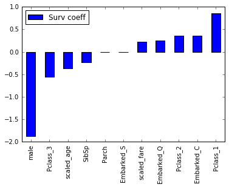

#  Feature Selection Lab

## Introduction

In this lab we will improve upon the analysis of the titanic dataset, performing feature selection and regularization.

## Exercise

#### Requirements

- Create column names
- K-best feature selection
- Recursive feature elimination
- Logistic regression coefficients
- Compare feature sets

**Bonus:**

- Plot the Logistic Regression coefficients

#### Starter code

[Starter code](code/starter-code/starter-code-4_2.ipynb)
>[Solution code](code/solution-code/solution-code-4_2.ipynb)

#### Deliverable

## Additional Resources

- [Scikit Learn Feature Selection](http://scikit-learn.org/stable/modules/feature_selection.html)
- [Logistic Regression](http://scikit-learn.org/stable/modules/generated/sklearn.linear_model.LogisticRegression.html)

