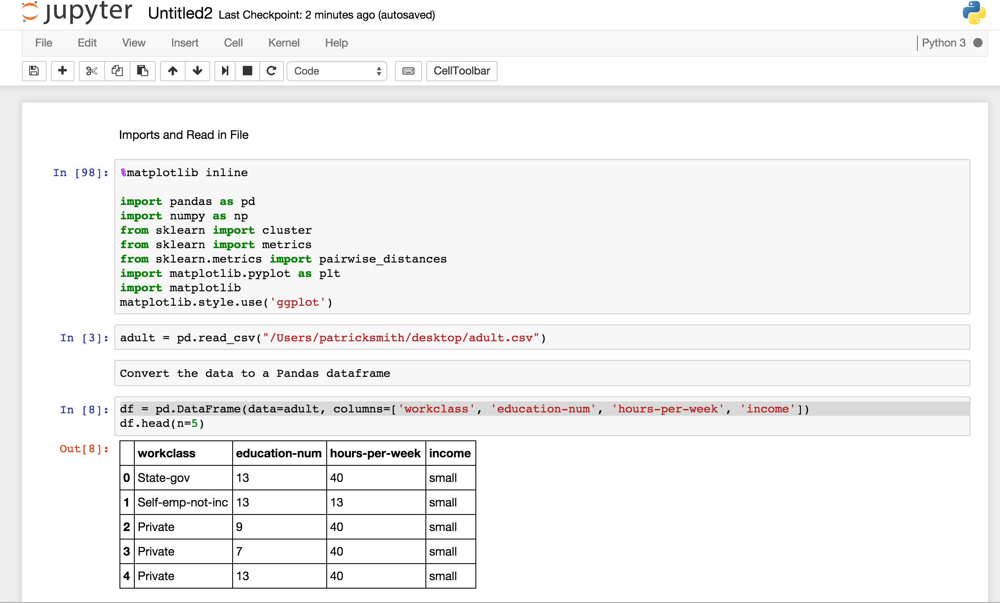

#  K-Means Clustering Lab

## Introduction

> ***Note:*** _This can be a pair programming activity or done independently._

We know what clustering is, how to setup your data for clustering, and how to evaluate your analysis. Now it's time to put your skills to the test! For this lab session, we are going to complete a full k-means clustering process using Python. 

You're working for a large marketing agency as a data scientist, and we're trying to market a high-end luxury good to consumers. We know that we want to target consumers with large incomes, however we do not know anything else about the demographic makeup of our target market. You're given a [dataset](./assets/datasets/adult.csv) with census information on income size and various other demographic indicators. Your task is to perform a clustering analysis to determine which demographic indicators relate to income size so that we can better target our marketing efforts.

## Exercise

#### Requirements

- Import the data
- Format the data - we've been given some messy census data; your job is to make sense of it
- Perform a K-Means test to inform us about our target market demographics
    - Use Scikit-Learn
- Find a Silhoutte Score for the clusters to evaluate your analysis

Just as in a real life scenario, the data and your analysis will not always be clear cut. While you may be wondering when you've succeeded in solving the problem,  we're looking for your best recommendations based on the available data. Work through the process until you and your teammate have enough information to provide an in-depth analysis to the agency.

**Bonus:**
- Perform a K-Means analysis on another subset of the data
- Find the centroids of your clusters (Hint: Use Scikit!)

#### Starter Code & Data

- Download the [data](./assets/datasets/adult.csv)
- Grab the [starter code](./code/starter-code/starter-code.ipynb) to get started. 

#### Deliverable

Your finished product will be a Jupyter Notebook containing your analysis, which will include;

- Your solution code
- A brief write-up on the demographic makeup of the target market 
- Recommendations for further analysis on this market

## Additional Resources

- A link to [K-Means Documentation](http://scikit-learn.org/stable/modules/generated/sklearn.cluster.KMeans.html)
- Extra relevant [Silhoutte Score Documentation](http://scikit-learn.org/stable/modules/generated/sklearn.metrics.silhouette_score.html)
