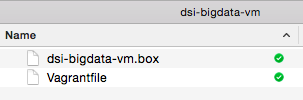
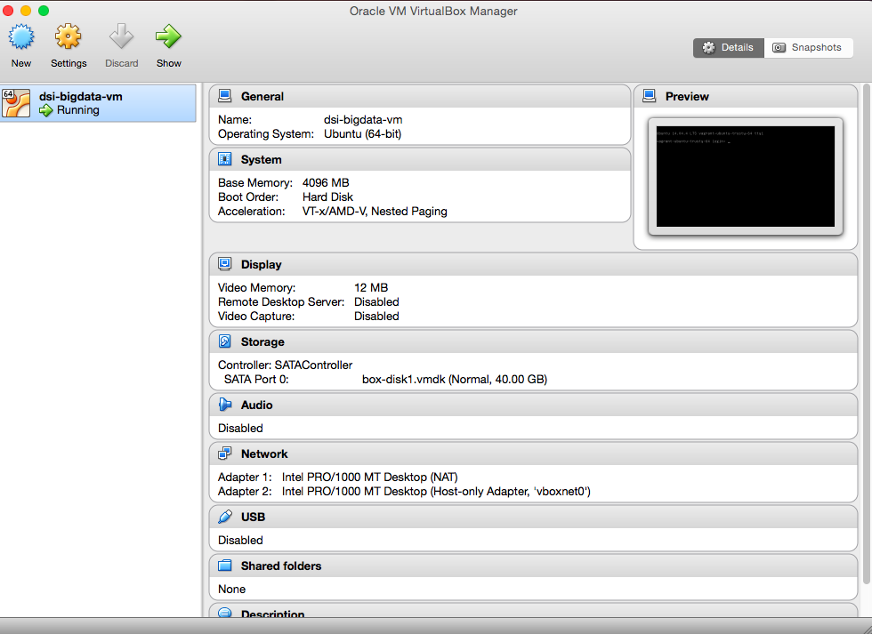

#  Hadoop Lab
Week 10 | Lab 1.2

### LEARNING OBJECTIVES
*After this lab, you will be able to:*
- Install local virtual machine running apache Hadoop
- Navigate Hadoop file system (HDFS)

### STUDENT PRE-WORK
*Before this lesson, you should already be able to:*
- Have Virtualbox installed on your system
- Have Vagrant installed on your system
- Have the Vagrant box folder already downloaded on your computer
- Perform Map-Reduce from shell using python scripts

### INSTRUCTOR PREP
*Before this lesson, instructors will need to:*
- Read in / Review any dataset(s) & starter/solution code
- Generate a brief slide deck
- Prepare any specific materials
- Provide students with additional resources
- Go through the installation of the virtual machine
- Note: Data assets for this lesson are included in the virtual machine.

### ADDITIONAL WEEK 10 PREP
This week requires additional prep in order to successfully run all lessons and labs provided:

1. [Download and install Virtual Machine](../VM-installation.md).
    - Note: This is a big file. Please reserve time to download and troubleshoot installation.
2. [Sign up for AWS Account & Credits](../AWS-instructions.md).
    - Note: Instructors will need to distribute individual URLs for the signup form. See linked instructions.

### LAB GUIDE

| TIMING  | TYPE  | TOPIC  |
|:-:|---|---|
| 5 min | [Opening](#opening) | Opening |
| 15 min | [Introduction](#introduction) | Installing the virtual machine |
| 10 min | [Guided](#guided_practice) | Launch the VM and start the Big Data tools |
| 5 min | [Guided-practice](#guided-practice) | Exploring HDFS from the command line |
| 5 min | [Guided-practice](#guided-practice) | Exploring HDFS from the web interface |
| 15 min | [Guided-practice](#guided-practice) | Hadoop word count |
| 15 min | [Guided-practice](#guided-practice) | Hadoop Streaming word count |
| 15 min | [Ind-practice](#ind-practice) | Hadoop Word Count |

<a name="opening"></a>
## Opening (5 min)
Over the course of the next three labs we will discover several tools to run map-reduce jobs. In particular in this lab we will explore Hadoop, which is a very common implementation of the map-reduce framework. We will do this through the use of a virtual machine, i.e. a simulated computer running on a host computer (our laptops).

This lab will guide you through the installation and configuration of a virtual environment that we will use throughout this week.

The environment is a virtual machine that runs on your computer and that comes packaged with a lot of neat software including:

- Hadoop
- Hive
- Hue
- Spark
- Python with many useful packages

Over the course of this week we will gradually discover this environment and what it can be used for.

<a name="introduction"></a>
## Installing the virtual machine (15 min)

The first step in our journey is going to be to start a local virtual machine which will use throughout this week.

We will build this virtual machine using Vagrant. From now on I will assume you have already installed:

- [Virtualbox](https://www.virtualbox.org/)
- [Vagrant](https://www.vagrantup.com/)

If you have not installed them, please go ahead and do that immediately.

### Download the virtual machine

By now you should already have downloaded the VM. In case you haven't, [download the following 2 files](https://www.dropbox.com/sh/ktjhecqklpvwcce/AADZBLKS6KQJL3hUt10eQiqSa?dl=0):

    dsi-bigdata-vm.box
    Vagrantfile

And save both to a local folder called `dsi-bigdata-vm`.




### Create the VM using Vagrant and Virtualbox

Vagrant is a tool for building complete development environments. With an easy-to-use workflow and focus on automation, Vagrant lowers development environment setup time, increases development/production parity, and makes the "works on my machine" excuse a relic of the past.

Oracle VM VirtualBox is a free and open-source hypervisor for x86 computers from Oracle Corporation. Developed initially by Innotek GmbH, it was acquired by Sun Microsystems in 2008 which was in turn acquired by Oracle in 2010.

VirtualBox may be installed on a number of host operating systems, including: Linux, OS X, Windows, Solaris, and OpenSolaris. It supports the creation and management of guest virtual machines running versions and derivations of Windows, Linux, BSD, OS/2, Solaris, Haiku, OSx86 and others.

For some guest operating systems, a "Guest Additions" package of device drivers and system applications is available which typically improves performance, especially of graphics.

In order to build our VM, do the following:

- open a terminal
- cd to the `dsi-bigdata-vm` folder you've just downloaded
- type: `vagrant up`

```bash
$ vagrant up

Bringing machine 'default' up with 'virtualbox' provider...
==> default: Importing base box './dsi-bigdata-vm.box'...
==> default: Matching MAC address for NAT networking...
==> default: Setting the name of the VM: dsi-bigdata-vm
==> default: Clearing any previously set network interfaces...
==> default: Preparing network interfaces based on configuration...
    default: Adapter 1: nat
    default: Adapter 2: hostonly
==> default: Forwarding ports...
    default: 22 (guest) => 2222 (host) (adapter 1)
==> default: Running 'pre-boot' VM customizations...
==> default: Booting VM...
==> default: Waiting for machine to boot. This may take a few minutes...
    default: SSH address: 127.0.0.1:2222
    default: SSH username: vagrant
    default: SSH auth method: private key
    default: Warning: Remote connection disconnect. Retrying...
    default: Warning: Remote connection disconnect. Retrying...
==> default: Machine booted and ready!
==> default: Checking for guest additions in VM...
    default: The guest additions on this VM do not match the installed version of
    default: VirtualBox! In most cases this is fine, but in rare cases it can
    default: prevent things such as shared folders from working properly. If you see
    default: shared folder errors, please make sure the guest additions within the
    default: virtual machine match the version of VirtualBox you have installed on
    default: your host and reload your VM.
    default:
    default: Guest Additions Version: 4.3.36
    default: VirtualBox Version: 5.0
==> default: Configuring and enabling network interfaces...
```

You will see a lot of text and at the end you should regain access to your terminal prompt.

If you open Virtualbox now, you should see that a VM has been added and it's running. Great!



<a name="guided_practice"></a>
## Connect to the VM start the Big Data tools  (10 min)

### Launch the VM

Now that the VM is running, you can connect via ssh from a the same terminal window by typing `vagrant ssh`

### Start the Bigdata tools

Once you're logged in type:

    $ bigdata_start.sh

and the following services will be started:

- Hadoop
- HDFS
- Yarn
- Hive server
- Spark cluster
- Jupyter Notebook

Let's have a look at some of the services available in this virtual machine.


### Hadoop
Apache Hadoop is an open-source software framework for distributed storage and distributed processing of very large data sets on computer clusters built from commodity hardware. All the modules in Hadoop are designed with a fundamental assumption that hardware failures are common and should be automatically handled by the framework.

The core of Apache Hadoop consists of a storage part, known as Hadoop Distributed File System (HDFS), and a processing part called MapReduce. Hadoop splits files into large blocks and distributes them across nodes in a cluster.


### HDFS
The Hadoop distributed file system (HDFS) is a distributed, scalable, and portable file-system written in Java for the Hadoop framework. It's the file system supporting Hadoop.

### YARN
Yarn is a resource-management platform responsible for managing computing resources in clusters and using them for scheduling of users' applications. The fundamental idea of YARN is to split up the functionalities of resource management and job scheduling/monitoring into separate daemons. The idea is to have a global ResourceManager (RM) and per-application ApplicationMaster (AM).

The ResourceManager and the NodeManager form the data-computation framework. The ResourceManager is the ultimate authority that arbitrates resources among all the applications in the system. The NodeManager is the per-machine framework agent who is responsible for containers, monitoring their resource usage (cpu, memory, disk, network) and reporting the same to the ResourceManager/Scheduler.

The Yarn resource manager offers a web interface, that is accessible on our VM at this address:

http://10.211.55.101:8088/cluster

Go ahead and type that in your browser and you should see a screen like this:


This will be useful when we run a hadoop job, in order to check the status of advancement.

<a name="guided-practice"></a>
## Exploring HDFS from the command line (5 min)

Hadoop offers a command line interface to navigate the HDFS. The full documentation can be found here:

http://hadoop.apache.org/docs/current/hadoop-project-dist/hadoop-common/FileSystemShell.html

The hadoop file system can be accessed by using the command:

    $ hadoop fs -ls

This command will default to the folder `/user/vagrant`, which is empty right now. If you type:


    $ hadoop fs -ls /

It will show you the content of the root folder in HDFS.

### Exercise 1:
Explore HDFS and describe the content of each folder it contains. You will need to use a combination of commands like:

    - ls
    - cat

<a name="guided-practice"></a>
## Exploring HDFS from the web interface (5 min)

Hadoop also offers a web interface to navigate and manage HDFS. It can be found at this address:

http://10.211.55.101:50070

and it looks like this:


### Exercise 2:
Find how you can navigate the HDFS from the web interface. Is the content listed similar to what you were finding with the command line?
> Answer: no, because the web interface displays the content of the root folder, while the hadoop fs command automatically goes into the /users/hadoop folder.

<a name="guided-practice"></a>
## Hadoop word count (15 min)

Let's create a very short file and count the number of words using Hadoop:

    $ hadoop fs -mkdir wordcount-input

    $ echo "hello dear world hello" | hadoop fs -put - wordcount-input/hello.txt

### Exercise 3:
Run the word count with the following command:

    $ hadoop jar /usr/local/lib/hadoop-2.7.2/share/hadoop/mapreduce/hadoop*example*.jar \
                  wordcount wordcount-input wordcount-output


Check the results by typing:

    $ hadoop fs -cat wordcount-output/part*

you should see:

    dear   1
    hello  2
    world  1

<a name="guided-practice"></a>
## Hadoop Streaming word count (15 min)

Hadoop also offers a streaming interface. The streaming interface will process the data as a stream, one piece at a time, and it requires to be told what to do with each piece of data. This is somewhat similar to what we did with the map-reduce from the shell that we used in the previous class.

Let's use the same python scripts to run a hadoop streaming map-reduce. We have pre-copied those scripts to your VM home folder, so that they are easy to access.

First of all let's copy some data to hdfs. The data folder contains a folder called `project_gutenberg`. Let's copy that to hadoop:

    $ hadoop fs -copyFromLocal data/project_gutenberg project_gutenberg
    $ hadoop fs -copyFromLocal scripts scripts

Go ahead and check that it's there:

http://10.211.55.101:50070/explorer.html#/user/vagrant

Great! Now we should pipe all the data contained in that folder through our scripts with hadoop streaming.
First let's make sure that the scripts work by using the shell pipes we learned in the last lecture.

    $ cat data/project_gutenberg/pg84.txt | python scripts/mapper.py | sort -k1,1 | python scripts/reducer.py

Great! They still work. Ok now let's do hadoop streaming MR:

    $ export STREAMING_JAR=/usr/local/lib/hadoop-2.7.2/share/hadoop/tools/lib/hadoop-streaming-2.7.2.jar

    $ hadoop jar $STREAMING_JAR  \
      -file /home/vagrant/scripts/mapper.py   \
      -mapper /home/vagrant/scripts/mapper.py \
      -file /home/vagrant/scripts/reducer.py  \
      -reducer /home/vagrant/scripts/reducer.py \
      -input /user/vagrant/project_gutenberg/* \
      -output /user/vagrant/output_gutenberg


Check the status of your MR job here:

http://10.211.55.101:8088/cluster/apps

You can check your results in the HDFS explorer:

http://10.211.55.101:50070/explorer.html#/user/vagrant/output_gutenberg

<a name="ind-practice"></a>
## Hadoop Word Count (15 min)

You have learned how to spin up a local virtual machine running Hadoop and how to submit map reduce job flows to it! Congratulations.

Go ahead and perform the map-reduce word count on the project gutenberg data using the Hadoop Jar used in exercise 3. You should get the list words with the counts as output. You can also save that list to a file and open it in Pandas to sort the words by the most frequent.

### ADDITIONAL RESOURCES

- [Hadoop](http://hadoop.apache.org/)
- [Hadoop command line](http://hadoop.apache.org/docs/current/hadoop-project-dist/hadoop-common/FileSystemShell.html)
- [YARN](http://hadoop.apache.org/docs/current/hadoop-yarn/hadoop-yarn-site/YARN.html)
- [Hadoop Streaming tutorial](http://www.michael-noll.com/tutorials/writing-an-hadoop-mapreduce-program-in-python/)
- [Hadoop Streaming doc](https://hadoop.apache.org/docs/r1.2.1/streaming.html)
