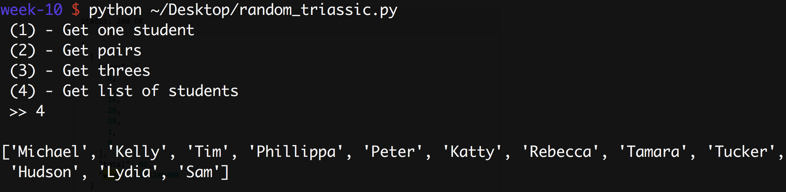

#  Morning Exercise: Randomizer
Week 10 | Exercise 1.0

Write a better python program to generate random pairs.

Here's your randomly generated partner to do that with:

### Pairs
```bash
('Kelly', 'Sam')

('Tim', 'Phillippa')

('Lydia', 'Katty')

('Michael', 'Peter')

('Tamara', 'Rebecca')

('Hudson', 'Tucker')
```

### Background
Here's how my input works:



Here's a list of students, which you'll need to include somewhere:
```
['Michael', 'Kelly', 'Tim', 'Phillippa', 'Peter', 'Katty', 'Rebecca', 'Tamara', 'Tucker', 'Hudson', 'Lydia', 'Sam']
```

### Requirement
Make this program better, and more random.

First, write a function to generate random pairs.

Then, generalize it. When you call the program, have it prompt you for a group size. Return random groups of that size. Include prompts for (a) calling on one person and (b) generating a random order of all students.

### Bonus
Write a program that generates a file 'student_pairs.txt' that lists unique classroom partner assignments. The list should be long enough that everyone is paired with everyone else by the end.

The output could look something like this:
```
DAY 1
('Jerry', 'Elaine')
('George', 'Kramer')

DAY 2
('Jerry', 'Kramer')
('George', 'Elaine')

DAY 3
('Jerry', 'George')
('Elaine', 'Kramer')
...
```
