#  AWS Elastic Map Reduce
Week 10 | Lesson 2.3

### LEARNING OBJECTIVES
*After this lesson, you will be able to:*
- spin up a cluster on AWS
- browse HDFS using Hadoop User Environment
- launch a HIVE Shell and execute HIVE queries on an EMR cluster

### STUDENT PRE-WORK
*Before this lesson, you should already be able to:*
- sign in to your AWS console
- run HIVE queries on the VM
- explain what Hadoop is and how it works


### LESSON GUIDE
| TIMING  | TYPE  | TOPIC  |
|:-:|---|---|
| 5 min | [Opening](#opening) | Opening |
| 5 min | [Introduction](#introduction) | Intro to EMR |
| 15 min | [Guided-practice](#guided-practice) | EMR cluster |
| 5 min | [Ind-practice](#ind-practice) | EMR cluster |
| 20 min | [Guided-practice](#guided-practice) | Configure Web Connection |
| 20 min | [Guided-practice](#guided-practice) | Hadoop User Environment [HUE] |
| 10 min | [Ind-practice](#ind-practice) | Independent practice |
| 5 min | [Conclusion](#conclusion) | Conclusion |

<a name="opening"></a>
## Opening (5 min)

In less 2.1 we have discovered 2 very important AWS services: EC2 and S3. Today we will see how to spin up a compute cluster on Amazon. 

**Check:** What is a cluster?
> Answer: a cluster is a set of several computers communicating with one another and working together to solve a problem.

**Check:** What is a typical topology for a Big Data computing cluster?
> Answer: a compute cluster generally has a star topology, with one master node and several job and task nodes.

<a name="introduction"></a>
## Intro to EMR (5 min)

Amazon Elastic MapReduce was introduce in April 2009 to automate _provisioning_ of the Hadoop cluster, running and terminating jobs, and handling data transfer between EC2(VM) and S3(Object Storage). It simplifies the management of a Hadoop cluster, making it available to anyone at the click of a button.

EMR offers several pre-installed software packages including:

- Hadoop
- HBase
- Pig
- Hive
- Hue
- Spark
and many others.

EMR also supports spot Instances since 2011. It's a good idea to run on spot instances to lower costs.

**Check:** Which of these have you already encountered on your local VM?
> Hadoop, Hive


### EMR Pricing

EMR Pricing is based on the type of instances forming the cluster and it's divided in tiers. The pricing adds to the cost of spinning up the instances in EC2.

Costs are calculated in hourly increments, so if we plan to use the cluster for 2 sessions of half an hour, we should have it up for 1 hour consecutively instead of spinning it up and down twice.

EMR is not included in the AWS free tier that you've used in the previous class, so it's always a good practice to do some price checking before you sping up a cluster.

We can use the [AWS cost calculator](https://calculator.s3.amazonaws.com/index.html) to estimate the cost of a 3 nodes cluster with medium size instances `(m3.xlarge)`. The image below shows the cost for 1 hour: it's slightly more than 1 dollar.

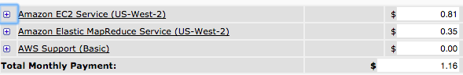

If we were to keep the cluster alive for a month, that would result in a pretty high price -- so spin down this cluster when you're done today!

<a name="guided-practice"></a>
## EMR cluster (15 min)

Let's spin up an EMR cluster with Hive and use it to perform a simple word count using Hive, like we did on the local VM. We will be following the [example provided by Amazon here](http://docs.aws.amazon.com//ElasticMapReduce/latest/ManagementGuide/emr-gs.html).

Log into AWS and first go to the S3 interface. Name a bucket, then click into it.

#### 1. Prerequisites
As a first step we will create 2 folders in an s3 bucket of ours and call them:
- input
- output

We can do this manually:

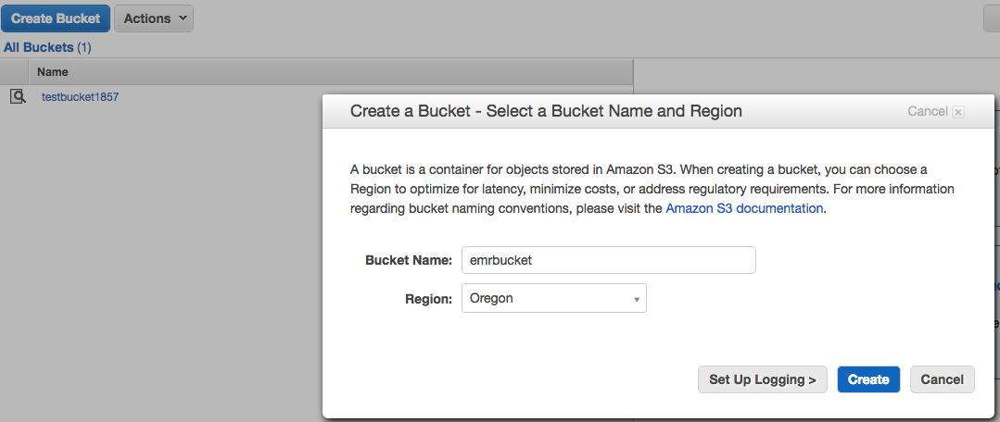

Or via the command line:

```bash
aws s3 ls

aws s3 mb s3://bucket-name
# you can remove it using aws s3 rb s3://bucket-name
```

Then go to the EMR service page, under the Analytics category:

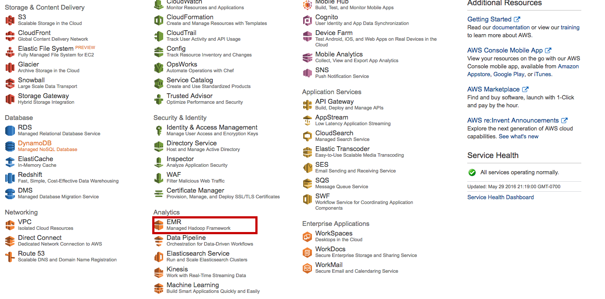

#### 2.  Launch Cluster


A couple important notes:

- Choose the key pair you have already stored on your computer.
- Use release 4.6.0, not the default. (This is so our example script will work; in general you can use the latest release.)

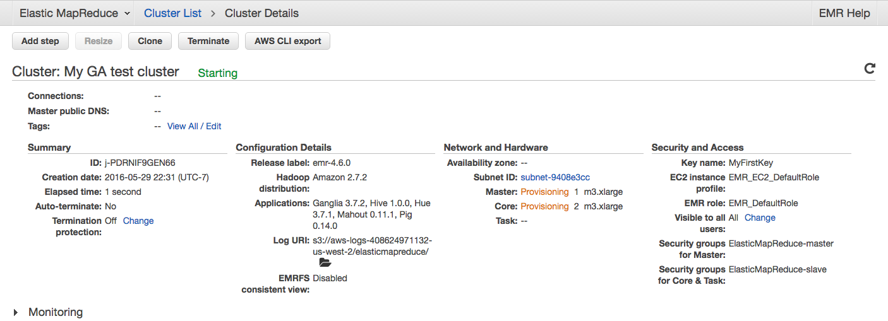

AWS will also export the corresponding AWSCLI command for you, which in this case is something like:

```bash
aws emr create-cluster \
    --applications Name=Ganglia Name=Hadoop Name=Hive Name=Hue Name=Mahout Name=Pig \
    --ec2-attributes '{"KeyName":"MyFirstKey",
                       "InstanceProfile":"EMR_EC2_DefaultRole",
                       "SubnetId":"subnet-9408e3cc",
                       "EmrManagedSlaveSecurityGroup":"8c01ffea",
                       "EmrManagedMasterSecurityGroup":"sg-8f01ffe9"}'
    --service-role EMR_DefaultRole --enable-debugging --release-label emr-4.6.0 \
    --log-uri 's3n://aws-logs-408624971132-us-west-2/elasticmapreduce/' \
    --name 'My GA test cluster' \
    --instance-groups '[{"InstanceCount":1,
                         "InstanceGroupType":"MASTER",
                         "InstanceType":"m3.xlarge",
                         "Name":"Master Instance Group"},
                        {"InstanceCount":2,
                         "InstanceGroupType":"CORE",
                         "InstanceType":"m3.xlarge",
                         "Name":"Core Instance Group"}]' \
    --region us-west-2
```

As with EC2, we can list the clusters in the Cluster List pane:

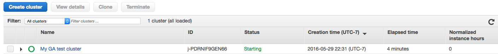

The cluster can take 5-10 minutes to boot completely. In the meantime, let's do a couple of review checks:

**Check:** Do you remember what exercise we did yesterday with HIVE?
> word count in books, log parsing using SERDE command.

**Check:** Do you remember how to connect to an instance on EC2?
> ssh -i key ec2-user@instancedns

**Check:** Do you remember which commands we used in AWSCLI?
> ec2 and s3

Once the cluster is ready we will see it in green:

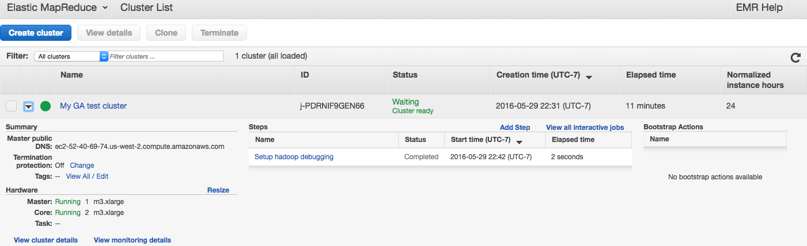

#### 3. Prepare sample data and script

We will analyze log data in a similar way as we did in the Hive exercise. The major difference here is that both our data and the computing power are somewhere in the cloud, instead of being on a virtual machine running on our laptop.

The sample data is a series of Amazon CloudFront web distribution log files. The data is stored in Amazon S3 at `s3://us-west-2.elasticmapreduce.samples` (make sure the region is your region).

Each entry in the CloudFront log files provides details about a single user request in the following format:

    2014-07-05 20:00:00 LHR3 4260 10.0.0.15 GET eabcd12345678.cloudfront.net /test-image-1.jpeg 200 - Mozilla/5.0%20(MacOS;%20U;%20Windows%20NT%205.1;%20en-US;%20rv:1.9.0.9)%20Gecko/2009040821%20IE/3.0.9

A sample Hive script is provided here:

    s3://us-west-2.elasticmapreduce.samples/cloudfront/code/Hive_CloudFront.q

The sample Hive script does the following:

- Creates a Hive table named cloudfront_logs.
- Reads the CloudFront log files from Amazon S3 using EMRFS and parses the CloudFront log files using the regular expression serializer/deserializer (RegEx SerDe).
- Writes the parsed results to the Hive table cloudfront_logs.
- Submits a HiveQL query against the data to retrieve the total requests per operating system for a given time frame.
- Writes the query results to your Amazon S3 output bucket.

The Hive code that creates the table looks like the following:

```sql
CREATE EXTERNAL TABLE IF NOT EXISTS cloudfront_logs ( 
	Date Date, 
	Time STRING, 
	Location STRING, 
	Bytes INT, 
	RequestIP STRING, 
	Method STRING, 
	Host STRING, 
	Uri STRING, 
	Status INT, 
	Referrer STRING, 
	OS String, 
	Browser String, 
	BrowserVersion String 
)
```

The Hive code that parses the log files using the RegEx SerDe looks like the following:

```sql
ROW FORMAT SERDE 'org.apache.hadoop.hive.serde2.RegexSerDe' 
WITH SERDEPROPERTIES ( "input.regex" = "^(?!#)([^ ]+)\\s+([^ ]+)\\s+([^ ]+)\\s+([^ ]+)\\s+([^ ]+)\\s+([^ ]+)\\s+([^ ]+)\\s+([^ ]+)\\s+([^ ]+)\\s+([^ ]+)\\s+[^\(]+[\(]([^\;]+).*\%20([^\/]+)[\/](.*)$" ) LOCATION 's3://us-west-2.elasticmapreduce.samples/cloudfront/data/';
```

The HiveQL query looks like the following:

```sql
SELECT os, COUNT(*) count FROM cloudfront_logs WHERE date BETWEEN '2014-07-05' AND '2014-08-05' GROUP BY os;
```

#### 4. Process Sample Data

Following the instructions [here](http://docs.aws.amazon.com//ElasticMapReduce/latest/ManagementGuide/emr-gs-process-sample-data.html) we can create a new step job based on the hive script by adding a `step` and assigning input, output and script buckets.

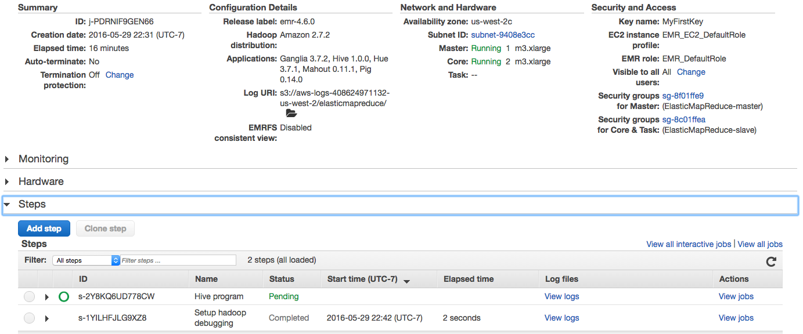

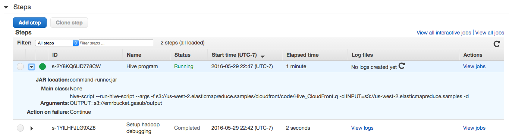

#### 5. Check results


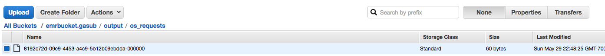


You can navigate your S3 bucket and check the results. There should be a new file, with the content:

    Android    855
    Linux      813
    MacOS      852
    OSX        799
    Windows    883
    iOS        794


Wonderful! We have just run a HIVE script on EMR!!

**Check:** We have run a HIVE script by defining a step. Do you think we could simply run hive commands from the HIVE command line?
> Answer: yes, we need to SSH into the master and then launch hive.


<a name="ind-practice"></a>
## EMR cluster (5 min)
Go ahead and SSH to your master node and launch Hive. They try to query the table you just created (`cloudfront_logs`).

If you're having trouble connecting, you may need to add SSH access permissions to your security group. Click `Security groups for Master:`, click the `Inbound` tab, `Edit`, `Add Rule`, then select SSH for the `Type` and My IP for `Source`.

<a name="guided-practice"></a>
## Configure Web Connection (20 min)

So far we have learned 2 ways of running HIVE. Can you list them?
> Answer:
>
- command line
- script passed as step to EMR cluster

We will now learn about HUE, or Hadoop User Interface, which is a great way to interact with a Hadoop cluster.

Before we can do that, will have to go trough one more step. In fact, the default security settings for EMR are pretty tight and do not allow for external web connections to our cluster. In order to connect with a browser we will have to set up an _ssh tunnel_, i.e. have our browser communicate to the cluster via an encrypted channel. Cool!

Luckily, Amazon provides us with simple instructions:

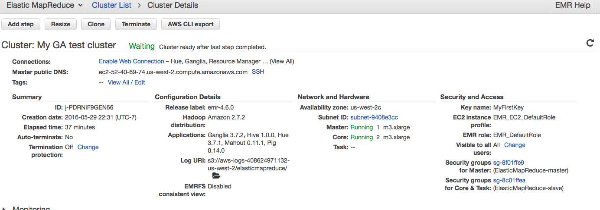

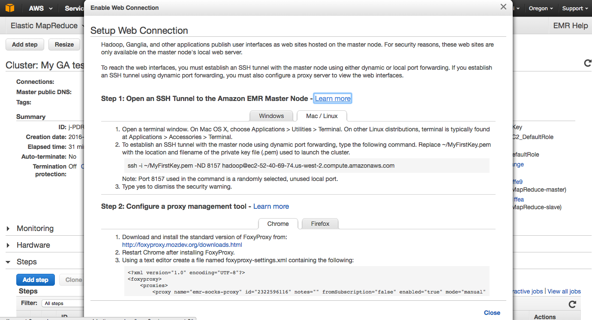

First we need to do a few things:

1) If you haven't already, enable SSH access to our master node. This is done in the Security Groups pane of the EC2 services page. (See above.)

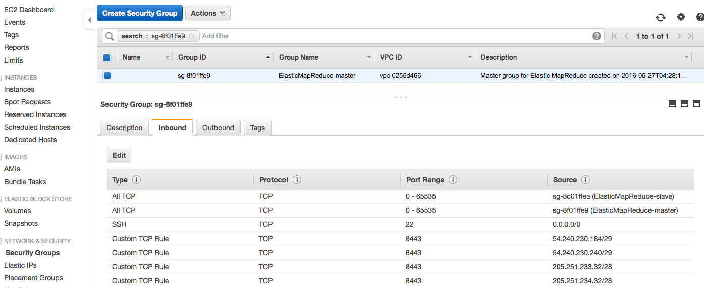

2) Add an inbound Custom TCP Rule, for ports 8888 and 50070, allowing access from your IP.

3) Install and configure Foxy-Proxy as explained [here](https://docs.aws.amazon.com/ElasticMapReduce/latest/ManagementGuide/emr-connect-master-node-proxy.html). (You want the "Proxy", "Standard" version.)

Once we have enabled SSH access, we can go ahead and connect:

```bash
ssh -i ~/.ssh/MyFirstKey.pem -ND 8157 hadoop@<YOUR_MASTER_DNS>
```

Note that this command won't appear to do anything - it will quietly run and keep the tunnel alive.

If the tunnel and Foxy-proxy are well configured, we should be able to connect to several web services. The one we are interested in is HUE.

<a name="guided-practice"></a>
## Hadoop User Environment [HUE] (20 min)

[Hue](http://gethue.com/) aggregates the most common Apache Hadoop components into a single interface and targets the user experience. Its main goal is to have the users "just use" Hadoop without worrying about the underlying complexity or using a command line.

It's accessible at the port 8888 of our master node, through an SSH tunnel. Since it's the first we use it, we'll have to set up a username and password. Choose whatever you'd like. (You'll probably be scrapping all of this at the end of the next lab.)


    http://<YOUR_MASTER_DNS>.compute.amazonaws.com:8888/


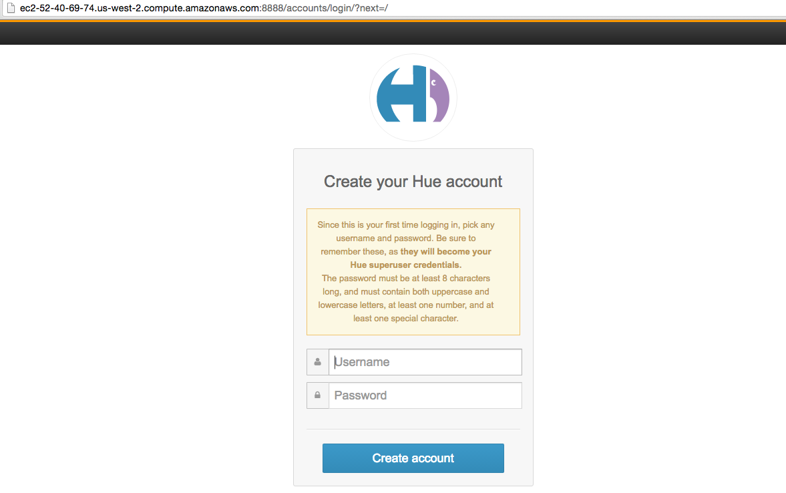

Let's also install all the examples:

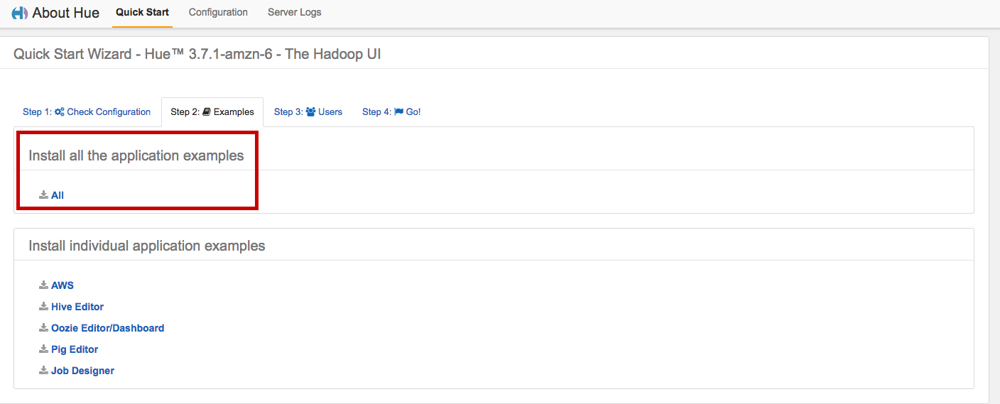

And we can finally open the Hue home page by clicking the home icon:

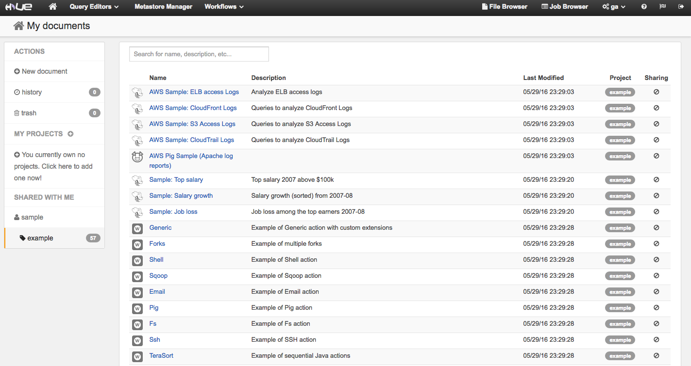


#### Example 1: AWS Sample: CloudFront Logs

Amongst the example there's one that looks familiar. It's the cloudfront sample logs script we've just executed in HIVE. Let's see what happens if we run it from HUE. Hit the EXECUTE button.

We will see the log of the MR being executed:

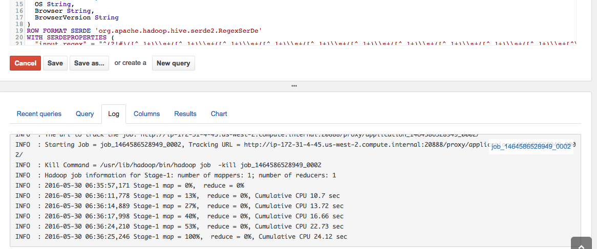

And the results:

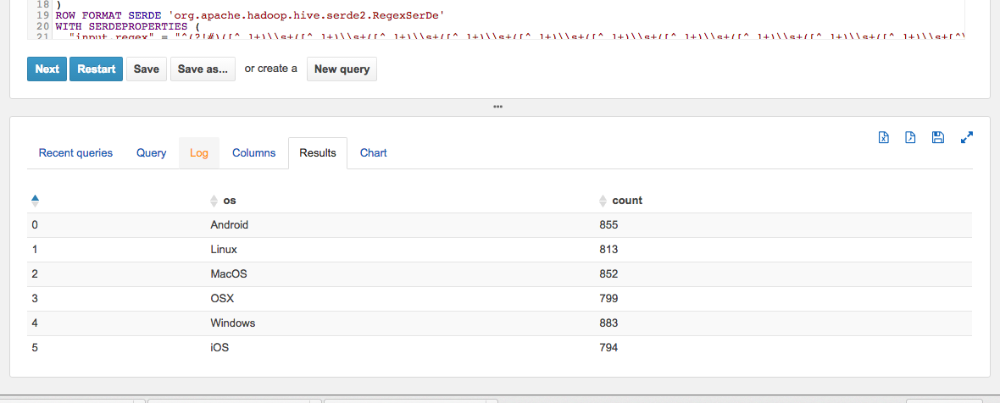

HUE also generates a nice chart for us:

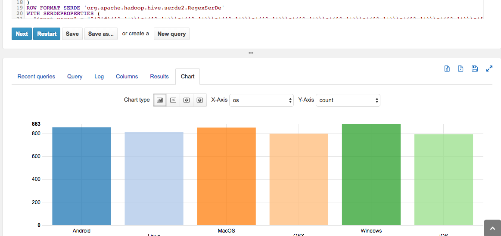

Note that you can progress to the `next` button to execute the next queries in the script.


Finally, note that we can also explore the HDFS like we were doing on the local VM by pointing our browser to the 50070 port:

    http://<YOUR_MASTER_DNS>:50070/dfshealth.html#tab-overview
    
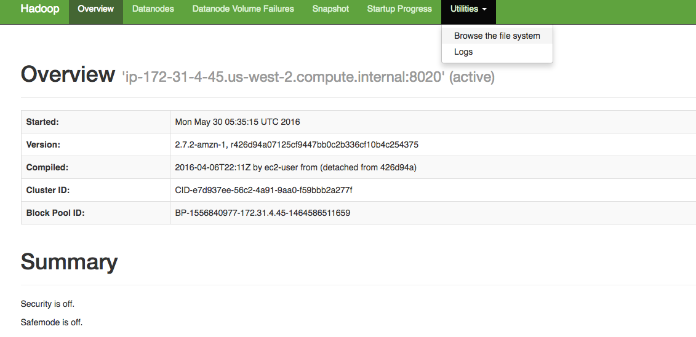

<a name="ind-practice"></a>
## Independent practice (10 min)

The HUE Home offers several other examples. In pairs choose an example and work through the code. Make sure you understand what it does and you execute it. Here are some questions to guide your discovery:

- what tables are present?
- how are they defined? what's the schema? how do you check it in HUE?
- what does the query do?
- how long does it take to execute?
- how much data does it process?
- what are the results?


<a name="conclusion"></a>
## Conclusion (5 min)

Today we have learned how to sping up a cluster on AWS and how to run HIVE queries on it using a script or using HUE.

Make sure you terminate your cluster now:

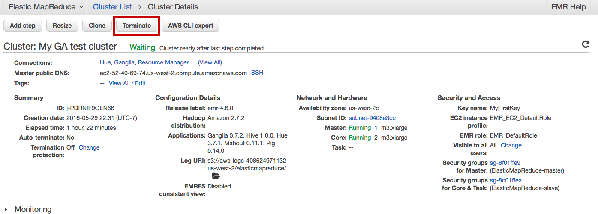

And also delete the buckets from S3, to avoid paying for storage space.

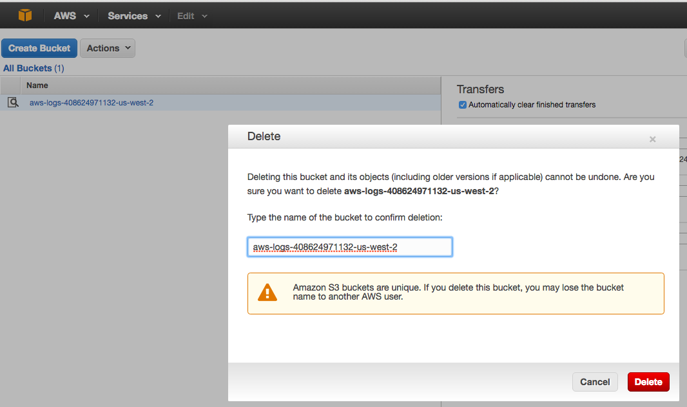


**Check:** Now that you're enabled with the ability to process very large dataset in the cloud. What problems would you like to tackle?


### ADDITIONAL RESOURCES

- [AWS EMR tutorial](http://docs.aws.amazon.com//ElasticMapReduce/latest/ManagementGuide/emr-gs.html)
