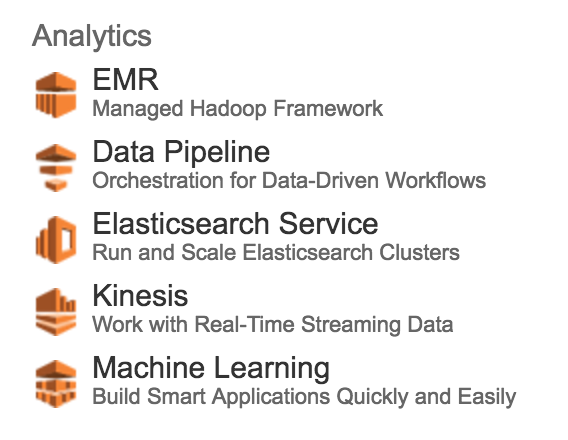
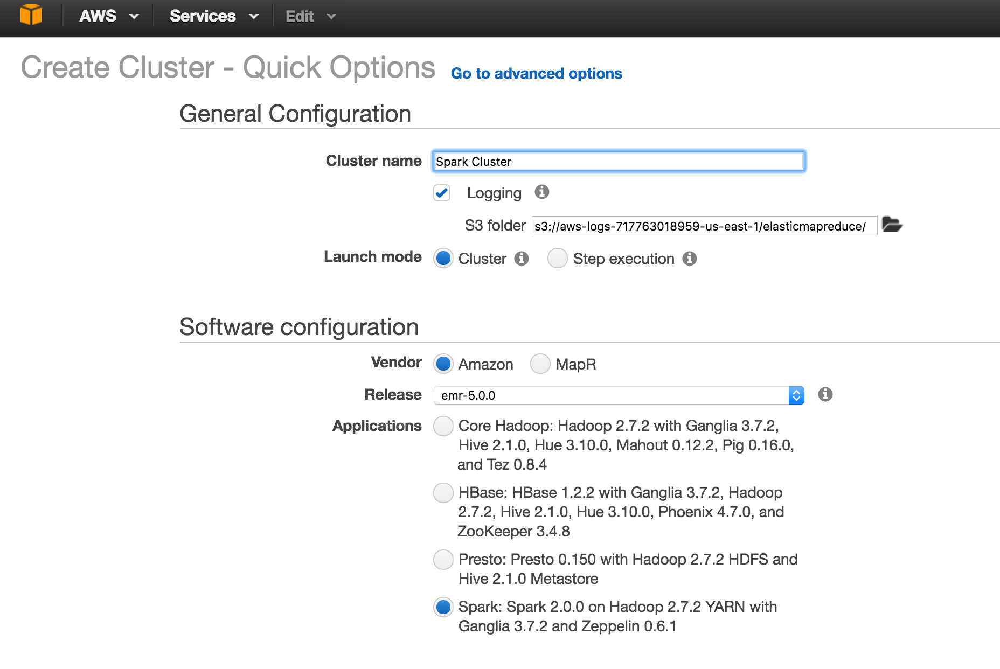
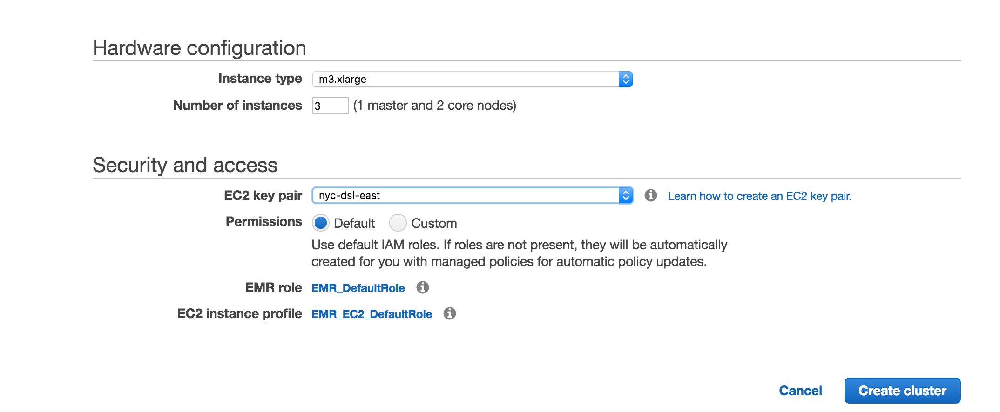
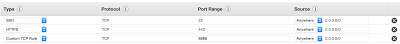
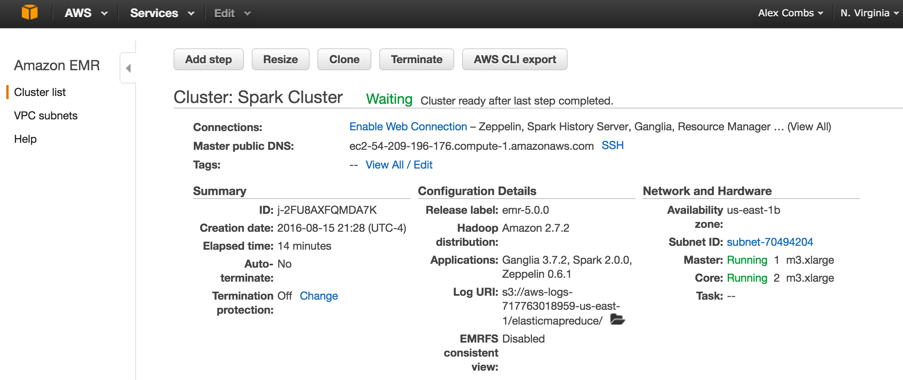
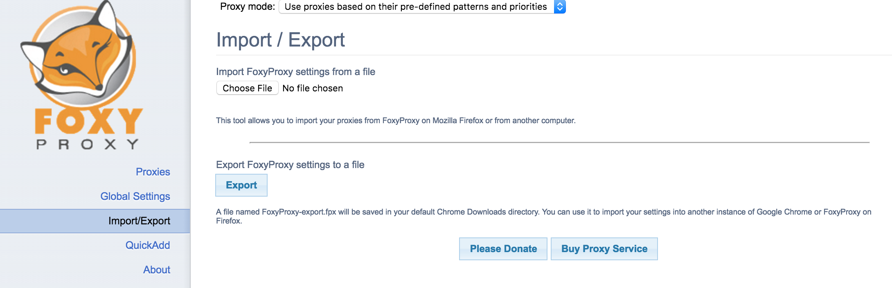
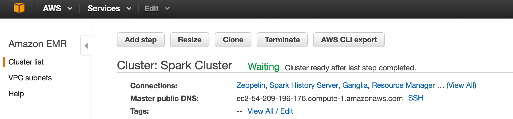
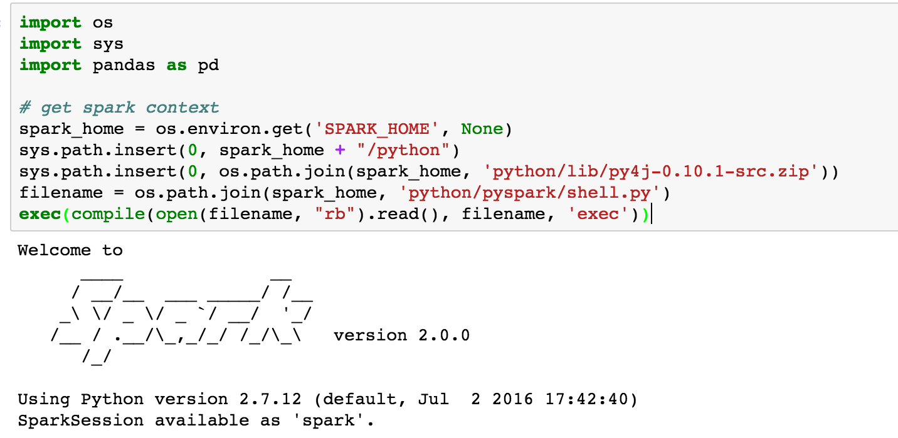

#  Jupyter + PySpark on EMR

Week 11 | Lesson 2.1

### LEARNING OBJECTIVES
*After this lesson, you will be able to:*
- Launch a Jupyter notebook on EMR
- Utilize PySpark in a Jupyter notebook on EMR


### STUDENT PRE-WORK
*Before this lesson, you should already be able to:*
- Use a Jupyter notebook
- Launched an EMR cluster
- Demonstrate a minimum level of proficiency with Spark

### INSTRUCTOR PREP
*Before this lesson, instructors will need to:*
- Generate a brief slide deck
- Ask guiding questions and review previously covered topics
- Prepare and tailor specific materials to your student's needs


### LESSON GUIDE
| TIMING  | TYPE  | TOPIC  |
|:-:|---|---|
| 5 min  | [Opening](#opening)  | Spark + EMR Review  |
| 15 min  | [Cluster Launch Review](#cluster)   | Launching a Cluster Review  |
| 15 min  | [Installing Conda](#conda)   | Installing Anaconda on AWS |
| 15 min | [Setting up a Jupyter Profile](#nb) | Setting a Jupyter Profile |
| 15 min | [Getting a Spark Context](#sc) | Getting a Spark Context |
| 15 min | [PySpark Operations in Jupyter](#pyspark) | PySpark Operations in Jupyter |
| 5 min | [Conclusion](#conclusion) | Conclusion |

---

<a name="opening"></a>
## Opening (5 mins)

We've seen previously:
- How to launch an EMR cluster on AWS
- How to work with Jupyter notebooks on your local machine
- How to work with PySpark on a VM

In this lesson, we'll learn how to tie it all together and launch an EMR cluster with the familiar Jupyter notebook interface and the power of PySpark at your disposal.

<a name="cluster">

## Launching a Cluster on AWS Review


Last week, we discussed how to launch an EMR cluster with a Hadoop environment installed. Today, we going to launch an EMR cluster with a Spark environment.

Step 1: Log into the AWS dashboard and select EMR



Step 2: Select Spark environment


Make sure to select the following options:





Make sure you have a working keypair; if not make sure to set one up. (They are region-specific.)

Click to create the cluster. It will take several minutes to boot up.

You will need to make sure you have port 22, 443, and 8888 open so you can ssh into the box. This is done through the EC2 tab -> Security Groups -> Inbound 



Once those are set and the cluster is ready, select the cluster from the cluster list by clicking on its name. 

Next, click 'Enable Web Connection'



Follow the directions to get a web connection enabled. You will need to open an ssh tunnel and get foxy proxy set up and working.



When that is all working you should see the AWS dashboard 'Connections' be clickable.



<a name="conda">

## Installing Anaconda

Now open a new terminal tab and ssh in to your EMR instance. You should see the EMR ascii art.
Once on the machine run the following commands to download and install Anaconda on the machine.

```bash
wget http://repo.continuum.io/archive/Anaconda2-4.1.1-Linux-x86_64.sh
bash Anaconda2-4.1.1-Linux-x86_64.sh
```
Follow the prompts to accept the user agreement and Anaconda will be installed. Accept all the defaults.

Once that is complete, set the PATH so that Anaconda is the default Python:

```bash
export PATH="/home/hadoop/anaconda2/bin":$PATH
```

When you type "conda" on the command line you should now get the conda help documentation.

We'll now move on to installing the notebook.

<a name="nb">

## Installing Jupyter Notebook 

In the EMR instance's terminal type the following:

```bash
ipython
```
This will launch an iPython instance. In that iPython instance, type the following:

```python
from IPython.lib import passwd
passwd()
```
You will be prompted to enter a password and to confirm it. Do that. Following this an sha key will be displayed. Copy the entire string.

Type exit to leave iPython.

We will now set up an IPython profile. Type the following to generate this.

```bash
jupyter notebook --generate-config
```

Leave that for now as we need to create a self-signed cert. From your home directory:

```bash
mkdir certs
cd certs
sudo openssl req -x509 -nodes -days 365 -newkey rsa:1024 -keyout mycert.pem -out mycert.pem
```

Now, let's go back and configure our Jupyter profile configuration.

```bash
cd ~/.jupyter
vim jupyter_notebook_config.py
```

This will open the config file. Next we'll make a few changes. Near the top of the file paste in the following. Remember when using vim, you should hit "i" to insert. Then paste the following:

```bash
c = get_config()
# Kernel config
c.IPKernelApp.pylab = 'inline'  # if you want plotting support always in your notebook
# Notebook config
c.NotebookApp.certfile = u'/home/hadoop/certs/mycert.pem' #location of your certificate file
c.NotebookApp.ip = '*'
c.NotebookApp.open_browser = False
c.NotebookApp.password = u'sha1:12121...'  #the encrypted password we generated earlier
c.NotebookApp.port = 8888
```
Then save the file and exit. (ESC -> ':wq' -> Enter)

Now we can almost launch our notebook, but first do the following:

```bash
cd ~/
export SPARK_HOME="/usr/lib/spark"
mkdir notebooks
cd notebooks
jupyter notebook
```
This will launch your notebook, but you won't see anything (which is good). To see our notebook, we need to go to the url listed on the dashboard near "Master public DNS". Copy this and paste it into your browser as follows where <aws_dns> is what you copied:

```bash
https://<aws_dns>:8888
```

You will get a horrifying warning that you can ignore. Click on 'Advanced' and then 'Proceed to...'

You will see a login screen like the following:


Use the password you used to generate your sha key earlier. If you did everything ok, you will be confronted my the joyous sight of a Jupyter notebook.

<a name="sc">

## Getting a Spark Context in Jupyter

If all went as planned, you have a new Jupyter instance running. Create a new notebook and open that. Run the following commands in the first cell to get a spark context running:

```python
import os
import sys
import pandas as pd

# get spark context
spark_home = os.environ.get('SPARK_HOME', None)
sys.path.insert(0, spark_home + "/python")
sys.path.insert(0, os.path.join(spark_home, 'python/lib/py4j-0.10.1-src.zip'))
filename = os.path.join(spark_home, 'python/pyspark/shell.py')
exec(compile(open(filename, "rb").read(), filename, 'exec'))
```

Run the cell and you should see the following output:



You should also be able to type in 'sc' hit return and see that you have a spark context. 


<a name="spark">

## PySpark Operations in Jupyter


Let's try some basic operations:
```python
# distribute our data
txt = sc.parallelize([('a', 1), ('b', 1), ('a', 1), ('a', 1), ('c', 2), ('d', 10)])

# reduce the data by key
red = txt.reduceByKey(lambda a, b: a+b).cache()

# view the results
print red.take(4)

# setting results in a DataFram
df = pd.DataFrame(red.take(4))
df.set_index(0, inplace=1)
df.index.name = None
df.columns = ['count']
df.sort_index()
```


Now with an external text file:

```python
# load the file
text_file = sc.textFile('s3://elasticmapreduce/samples/wordcount/input/0001')

# view the head
text_file.take(5)

# calculate the word counts
word_counts = text_file \
    .flatMap(lambda line: line.split()) \
    .map(lambda word: (word, 1)) \
    .reduceByKey(lambda a, b: a + b)
    
# run the operation
word_counts.collect()

# now try putting the results in a DataFrame
```

Things you could also try:
- Saving an AMI snapshot of the master EC2 node to launch new instances later
- Setting up a permanent, public-facing IP address with ElasticIP
- Adding your own domain name to the box
- You could also launch your own flask app on this

<a name="conclusion">

## Conclusion

In this lesson we've seen how to how to launch an EMR cluster that leverages the power of PySpark in a Jupyter notebook.

Additional PySpark Resources:
- [PySpark documentation](http://spark.apache.org/docs/2.0.0/api/python/index.html)
- [From Pandas DataFrame to Spark DataFrames](https://databricks.com/blog/2015/08/12/from-pandas-to-apache-sparks-dataframe.html)
- [PySpark DataFrame](http://blog.brakmic.com/data-science-for-losers-part-5-spark-dataframes/)


