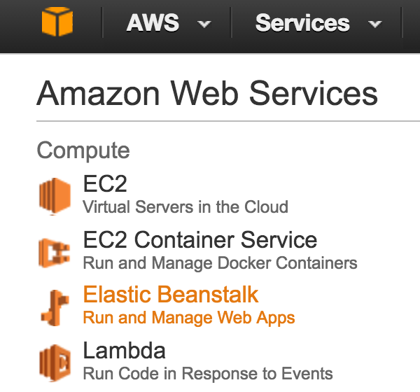
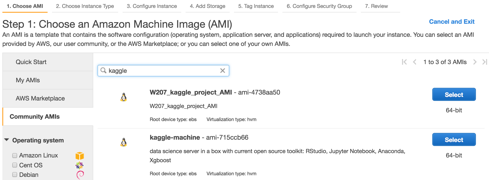
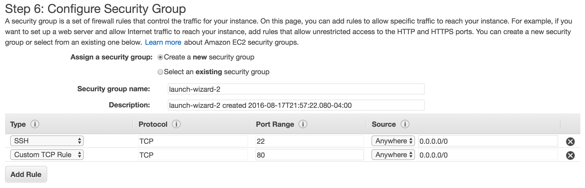
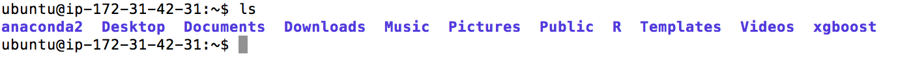
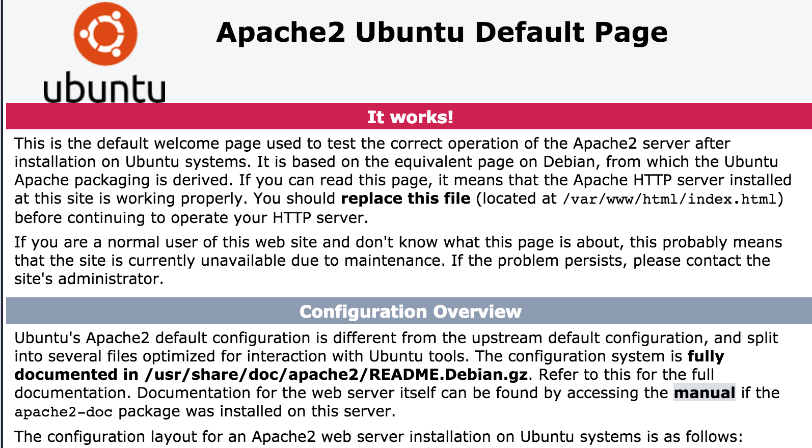
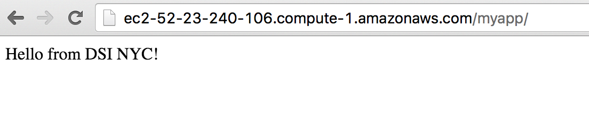
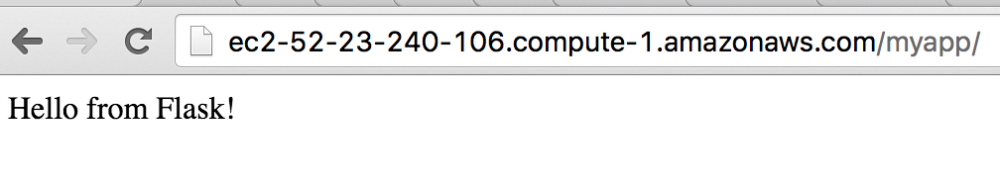

#  Launching Flask Apps on AWS

Week 11 | Lesson 4.1

### LEARNING OBJECTIVES
*After this lesson, you will be able to:*
- Launch an EC2 box with an Apache webserver and Flask app
- Create a front-end page with a form that accepts user input
- Send POST requests from the front-end to the back-end flask app
- Return processed data to a front-end


### STUDENT PRE-WORK
*Before this lesson, you should already be able to:*
- Use AWS Services such as EC2
- Understand what Flask is and does
- Create minimum viable HTML pages
- Utilize basic Linux commands

### INSTRUCTOR PREP
*Before this lesson, instructors will need to:*
- Generate a brief slide deck
- Ask guiding questions and review previously covered topics
- Prepare and tailor specific materials to your student's needs


### LESSON GUIDE
| TIMING  | TYPE  | TOPIC  |
|:-:|---|---|
| 5 min  | [Opening](#opening)  | Create a Web App  |
| 10 min  | [Demo/Guided Practice](#ec2)   | Launching an EC2 Box (AMI)  |
| 10 min  | [Demo/Guided Practice](#apache)   | Setting up an Apache Web Server |
| 10 min | [Demo/Guided Practice](#hw) | Hello World Page |
| 15 min | [Demo/Guided Practice](#flask) | Running a Flask App |
| 15 min | [Demo/ Guided Practice](#form) | Setting Up a Web Form |
| 15 min | [Demo/Guided Practice](#jinja) | Returning Values |
| 15 min| [Demo/Guided Practice](#tie)| Tying It All Together|
| 5 min | [Conclusion](#conclusion) | Conclusion |

---

<a name="opening"></a>
## Opening (5 mins)

In class so far, we've used AWS EMR for running a cluster with Hadoop, we've launched a Jupyter notebook on AWS, and we've run basic Flask apps before. Today, we'll revisit AWS and Flask one last time to learn how to build an end-to-end solution for taking data input via a web page, processing it, and then finally returning the output via a webpage. We'll do all this on an EC2 instance that is accessible to the public. 

Hopefully, you'll use this as inspiration for showcasing your capstone!

<a name="ec2"></a>
## Demo/Guided Practice: Launching an EC2 Box (10 mins)

We have launched and EC2 instance before, so we'll just quickly go through this. The one difference is that we'll be using an existing AMI with Anaconda and a number of other tools we'll utilize rather than starting from scratch.

Step 1:

Log into AWS and select EC2.



Step 2: 

In the EC2 dashboard, click 'Launch Instance'


Step 3: 

On the left, when configuring the box, select 'Community AMI'. Then search for 'kaggle' and select the box called 'kaggle-machine'. Select that and continue on with the defaults. 



Make sure that in security groups for the box that port 80 (web) and 22 (ssh) are open and reachable from anywhere. 


Complete the final steps involving the default params and key pair info, then launch.

When the box spins up and is ready select it in the dashboard then click the 'Connect' button get get the address info necessary to connect via ssh from your terminal.


You should see the ssh string with "root@ec....". You will need to change "root@" to "ubuntu@" before you connect.

One you are on the box, do an 'ls' and you should see a number of libraries including Anaconda and xgboost.



If you see that all is going well!

<a name="apache"></a>
## Demo/Guided Practice: Setting Up an Apache Web Server (10 mins)

Now we need to set up an Apache web server. Run the following commands in you terminal:

```bash
sudo apt-get update
sudo apt-get install apache2
sudo apt-get install libapache2-mod-wsgi
sudo a2enmod wsgi
```
That will install a number of updates and libraries. Once that is complete, we're ready to test our first web page.

Go to the EC2's public web address and put that in your browser. The address is on the page where you go to find the ssh info ('Connect').

You should see the following:


<a name="hw"></a>
## Demo/Guided Practice: Setting Up the Hello World Page (5 mins)

Now we're ready to launch our own page.

Perform the following steps to do so:

```bash
cd /var/www/html
mkdir sudo myapp
cd myapp
sudo touch index.html
sudo chmod 755 index.html
sudo vim index.html
```

What did we do there? We moved into the Apache directory that holds the files that are served as webpages. We then made a new directory there called myapp. We then changed into that directory and created a page called index.html. Finally, we set the permissions on the file and opened it in our text editor.

Now that you are in vim, you should hit 'i' for insert, and then type in something like the following: "Hello from DSI NYC!". Once you have that done, hit 'ESC' and then ':wq'. This means write the file and then quit vim.

Once that is done, we can view our webpage. Go the the address you did earlier for the box in your browser, but this time add '/myapp' or '/myapp/index.html' to the end.

If everything went according to plan, you will see the following:



Congrats! You have the most boring page on the web! Let's now make it better by adding a flask app back-end.

<a name="flask"></a>
## Demo/Guided Practice: Running a Flask App (15 mins)

Now let's do the following to get Flask up and running.

```bash
cd /var/www/html/myapp
sudo touch myapp.py
sudo chmod 755 myapp.py
sudo vim myapp.py
```
Once you are in vim, paste in the following code, save it, and exit.

```python
from flask import Flask
app = Flask(__name__)

@app.route('/')
def hello_world():
  return 'Hello from Flask!'

if __name__ == '__main__':
  app.run()
```

Next, we need to create a wsgi file which will tell Apache to serve from our Flask app.

```bash
sudo touch myapp.wsgi
sudo chmod 755 myapp.wsgi
sudo vim myapp.wsgi
```

Past the following into the file:

```python
import sys
sys.path.insert(0, '/var/www/html/myapp')
sys.path.insert(0, '/home/ubuntu/anaconda2/bin/python')
sys.path.insert(0, '/home/ubuntu/anaconda2/lib/python2.7/site-packages')

from myapp import app as application
```
Then save and exit.

We have to enable mod_wsgi now to complete the connection between Flask and Apache. This ensures that pages are from Flask and not the default static web pages (like the one you created earlier). We can do this as follows:


```bash 
sudo vim /etc/apache2/sites-enabled/000-default.conf
```


Then insert the following code. It should go after the 'DocumentRoot /var/www/html' line.

```bash
        WSGIDaemonProcess myapp threads=5
        WSGIScriptAlias /myapp /var/www/html/myapp/myapp.wsgi

    <Directory myapp>
        WSGIProcessGroup myapp
        WSGIApplicationGroup %{GLOBAL}
        Order deny,allow
        Allow from all
    </Directory>
```

Now when you go to your webpage '/myapp' in your browser you should see:




<a name="form"></a>
## Demo/Guided Practice: Setting Up a Web Form (15 mins)

Now that we have the basic Flask app deployed, let's now set up a page with a form that can accept user input.

We'll first create the page. This should be in your /myapp directory.

```bash
sudo touch input_page.html
sudo chmod 755 input_page.html
sudo vim input_page.html
```

Now let's add the following code to that page:

```html
<!DOCTYPE html>
<html>
<form action="make_it_happen" method="post">
  First name: <input type="text" name="myname"><br><br>
  Excitement Level: <input type="text" name="mylevel"><br>
  <input type="submit" value="Submit">
</form>
</html>
```

Now save that and exit vim. 

That is our input page. We now need to modify Flask to accept the input from this page. We'll open the myapp.py file using:

```bash
sudo vim myapp.py
```

We are going to replace what's in there with the following code:

```python
import jinja2
from flask import Flask, render_template, request
app = Flask(__name__)
app._static_folder = '/var/www/html/myapp/'

@app.route('/')
def send_form():
  return app.send_static_file('input_page.html')


@app.route('/make_it_happen', methods=['POST'])
def say_hi():
  name=request.form['myname']
  excitement_level=request.form['mylevel']
  return render_template('stuff_you_know.html', name=name, lvl=excitement_level)

if __name__ == '__main__':
  app.run()
```

We'll walk through what each piece of this does. The first piece of code under the imports set our app as Flask and point it to where we will be serving our static HTML pages. This is the directory of our '/myapp'. 

Next we have a function that runs when the default route for our app is called ('/'). We are returning the page we just created. 

The next function is called when the form is submitted and takes the payload of that form: the entered name and the level of excitement level. It then sends it to what is called a string template. A string template allows us to pass in values from our code that can then be manipulated outside of our code in the HTML. This allows for a separation of concerns. The view can be dynamically generated based on the values passed to it, rather than having to code all the conditionals in Python on the back-end.

We capture the values passed to us in the form. Notice that the names in the HTML are captured and stored into Python variables.

Next, we discuss how to return an output with those values.

<a name="jinja"></a>
## Demo/Guided Practice: Returning Values (15 mins)

The return of that last function is returning a page that utilizes a Jinja2 string template. We are passing our Python variables, 'name' and 'excitement_level' to our string template under the Jinga2 variable names 'name' and 'lvl'. We could have used any variable names for these. We can also use as many as we want. Note, that they don't have to just be an integer. The can be a string or a list of values or basically any other type.

The next step is to create the folder that will hold our output pages.

In the /myapp directory:

```html
mkdir templates
sudo chmod 755 templates
cd templates
sudo touch stuff_you_know.html
sudo chmod 755 stuff_you_know.html
sudo vim stuff_you_know.html
```

You should be in the file now. Next we need to populate it.

```python
<!DOCTYPE html>
<html>
<head>
</head>
<body>
 <center>
 {{ name }} your excitement level is {{ lvl }}
 
  is a failure. Shame.<br><br>
  
 
  is meh. Try harder.<br><br>
  
 
  is fantastic. You are a star.<br><br>
  
 
  </center>
</body>
</html>
```
N.B.: We are hotlinking in this example, but that should be discourage in any live app. Use images served from the box you are on.

Lots of code there. What's going on?

Our variables that we passed in using Flask were 'name' and 'lvl' if you remember. Notice that we are using those here. The are in the curly braces ```{{ name }}```
and ```{{ lvl }}```. Just putting the curly braced values prints out to our page the values we passed in. 

Here we also employed some conditional logic. This is how string templating works. We can do a number of operations using Jinja2; we can do everything from formatting values to showing or hiding data based on its values. It is very flexible and prevents us from having to change our back-end code for every scenario.


<a name="tie"></a>
## Demo/Guided Practice: Tying It All Together (10 mins)

Now that we have all the pieces, go ahead and go to the page for our app.

```<aws_address>/myapp```

Fill in the form. Try different values like 2, 7, 10.

Notice how the output changes with those values.

What are some ways you could use this in your work?


<a name="conclusion"></a>
## Conclusion (5 mins)


In this lesson we have learned how to launch and AWS EC2 box from an existing AMI. We learned how to install an Apache webserver and to use mod_wsgi to run our flask application as a daemon. We also learned how to build a front-end that can take in values that are POST'ed to the back-end flask application. We saw how those values can be processed or not and then passed into a string template engine.

Some additional things we could have done:
- Change the mimetype on our form to pass in a csv
- Manipulate the variables in Python/Flask before returning them
- Use a charing library to visualize what we pass to the templates


